<meta charset="UTF-8">


## SPP Performance Spectrum Patterns Miner

Artifact accompanying the 23rd International Conference on Service-Oriented Computing ([ICSOC 2025](https://icsoc2025.hit.edu.cn/)) Demos and Resources track submission.

**Authors and Affiliations:**  
- [Tsung-Hao Huang](mailto:tsunghao.huang@rwth-aachen.de) (RWTH Aachen University)  
- [Gyunam Park](mailto:g.park@tue.nl) (Eindhoven University of Technology)  
- [Volodymyr Diemieniev](mailto:volodymyr.diemieniev@rwth-aachen.de) (RWTH Aachen University)  
- [Jasper Saathoff](mailto:jasper.saathoff@rwth-aachen.de) (RWTH Aachen University)  
- [Moritz Schlegelmilch](mailto:moritz.schlegelmilch@rwth-aachen.de) (RWTH Aachen University)  
- [Piotr Zaniewski](mailto:piotr.zaniewski@rwth-aachen.de) (RWTH Aachen University)  
 
**Repository:** [GitHub](https://github.com/moritzkschlegelmilch/performance-spectrum-patterns-miner)  
**License:** [MIT](https://github.com/moritzkschlegelmilch/performance-spectrum-patterns-miner/blob/main/LICENSE)  
Please cite this work using the [CITATION.cff](https://github.com/moritzkschlegelmilch/performance-spectrum-patterns-miner/blob/main/CITATION.cff) file.

## Table of Contents

1. [Introduction](#1-introduction)  
   1.1 [Problem Statement](#11-problem-statement)  
   1.2 [Spectral Pattern Analysis](#12-spectral-pattern-analysis)  
   1.3 [Limits of traditional Spectral Pattern Analysis](#13-limits-of-traditional-spectral-pattern-analysis)

2. [Start Guide](#2-start-guide)  
   2.1 [Prerequisites](#21-prerequisites)  
   2.2 [Docker Deployment](#22-docker-deployment)

3. [Getting Started: Event Log Upload (Web UI)](#3-getting-started-event-log-upload-web-ui)  
   3.1 [Uploading the .xes File](#31-uploading-the-xes-file)  
   3.2 [Mapping Event Log Columns](#32-mapping-event-log-columns)  
   3.3 [Analyzing the Event Log](#33-analyzing-the-event-log)  
   3.4 [Accessing Uploaded Event Logs](#34-accessing-uploaded-event-logs)  
   3.5 [Event Logs Page Overview](#35-event-logs-page-overview)  
   3.6 [Troubleshooting](#36-troubleshooting)

4. [Viewing the Spectrum](#4-viewing-the-spectrum)  
   4.1 [Page Overview](#41-page-overview)  
   4.2 [Manipulation, Filters & Export](#42-manipulation-filters--export)  
   4.3 [Exporting a spectrum](#43-exporting-a-spectrum)    
   4.4 [Statistics](#44-statistics)  
   4.6 [Comparing spectra](#46-comparing-spectra)

5. [Developer Guide](#5-developer-guide)  
   5.1 [Backend](#51-backend)  
   5.2 [Frontend](#52-frontend)

## 1. Introduction
### 1.1 Problem Statement 
In today's fast-paced digital landscape, businesses are under constant pressure to optimize how they work. To stay competitive, they must uncover hidden inefficiencies in their processes and resolve them quickly.

One of the most effective ways to oversee a company's processes and operations is to apply *process mining* and look at what is called an *event log*, which is essentially a record of everything that happens in a business process—each task, step, or activity that occurs as part of a workflow. By analyzing these records, one may be able to identify where things are going well, and where there is still room for optimization.

This kind of analysis, regardless of the method, is often performed on traditional *process models*. A process model is (often) a diagram that shows the steps of a process, and its control flow. It gives a good overview of the structure of a process—what comes first, what happens next, and where decisions are made.

But these diagrams can miss important information. They show what happens, but not *how long* things take, or *how smooth* the handover is between different parts of the process. For example, imagine a situation where a document needs approval after submission. The model might show that "submit document" leads to "approve document"—but what if that approval often takes several days because someone has to manually check their email? Traditional process models often fail to provide quantitative analysis of specific cases within process segments.

This is where *spectral pattern analysis* comes into place. Spectral pattern analysis offers a new way to visualize process variants. Instead of just focusing on the structure of the process, it highlights *timing and communication patterns*. This helps us detect delays, clusters of similar cases, or parts of the process where work slows down.

<figure>
    
    <figcaption><i>Spectral pattern</i> visualization of a <i>graph model </i> <a href="https://www.vdaalst.rwth-aachen.de/publications/p1027.pdf">[1]</a></figcaption>
</figure>
 
### 1.2 Spectral Pattern Analysis
Below, one can see an example of a *Performance Spectrum*. All activities are listed along the vertical axis. Time runs along the horizontal axis. When two activities are connected in time (for example, task A is followed by task B), a line is drawn between them. The angle or steepness of the line shows how quickly that handover happened. A steep line means the tasks happened quickly, while a shallow line indicates a delay.
This effect is also supported by the color of the line: the darker the color, the longer the delay between the two activities. This way, we can see where delays are happening in the process at one glance .

<figure>
    
    <figcaption> Different ways to separate overlapping patterns in Performance Spectra</figcaption>
</figure>


### 1.3 Limits of traditional Spectral Pattern Analysis
Real-world processes are often very complex and most importantly incredibly large, often covering hundreds of thousands, if not millions of cases. *Fig. 2* (top) shows a traditional Performance Spectrum of an event log that covers around 150.000 cases. It is almost impossible to detect any patterns that could help the user understand which cases are delayed and most importantly, why.

The tool described in this manual looks to overcome this limitation by implementing intuitive filtering methods and ways to separate overlapping patterns within the noisy data to find out which cases cause delays as well as to allow further analysis with the data.


---

## 2. Start Guide

### 2.1 Prerequisites
  
- **Docker & Docker Compose** (for containerized deployment) 

### 2.2 Docker Deployment

We provide Dockerfiles for both backend and frontend so one can run the entire app in containers. Once in the project parent directory, run: 

```bash
# Build images
docker-compose build

# Start all services (API + UI) via Docker Compose
docker-compose up 
```

- The Backend API will now serve at **http://localhost:8000/**.  
- The Frontend UI will now serve at **http://localhost:5173/**.  

If, for some reason, deployment did not work as expected in the first run, try:
```bash
docker-compose down
docker-compose build --no-cache
docker-compose up
```
---

## 3. Getting Started: Event Log Upload (Web UI)

This manual provides a step-by-step guide for uploading and preparing an event log file in the `.xes` format. The upload process consists of three primary stages: **file submission**, **column mapping**, and **analysis initiation**.

---

### 3.1 Uploading the `.xes` File

To begin the upload process, proceed as follows:

1. Navigate to the **Upload** section from the main navigation menu.
     

   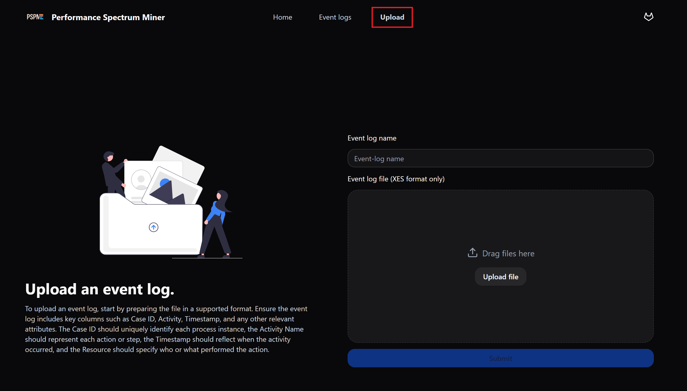
2. Click on the designated upload area and select a `.xes` file from your local device. Make sure that it has a valid format as the tool may not work in the intended way if not.
3. Enter a **name** for the event log in the provided input field.
4. Click the **Submit** button to initiate the upload.  

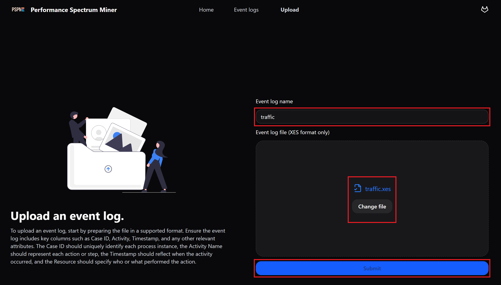

> **Note:** The system accepts only files in the `.xes` (eXtensible Event Stream) format.

> **Important:** After submitting, be patient. Depending on the file size, processing the log may take several minutes.

---

### 3.2 Mapping Event Log Columns

Upon successful file submission, the system will prompt the user to define the columns corresponding to the following required attributes:

- **Case ID**
- **Activity**
- **Timestamp**

In the provided table. Select the columns in the order described by the system. Click ```Choose``` to set the column mapping. Typical attribute names in `.xes` files include:

| Attribute | Common Names in .xes Files                         |
| --------- | -------------------------------------------------- |
| Case ID   | `case:concept:name`                                |
| Activity  | `concept:name`, `activity`, `lifecycle:transition` |
| Timestamp | `time:timestamp`                                   |

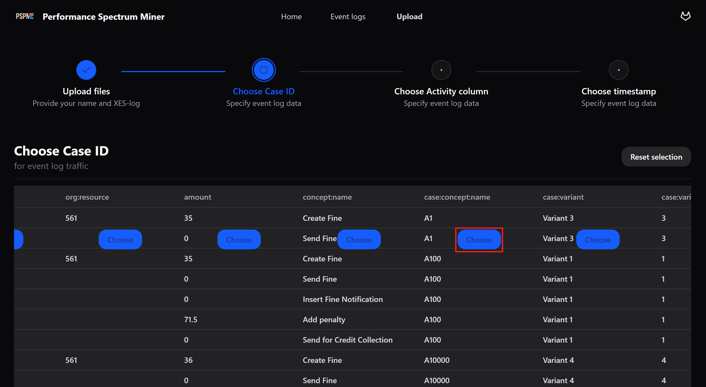

If an incorrect mapping was made by incident, one may use the **Reset** button to clear the selections and start over again.  

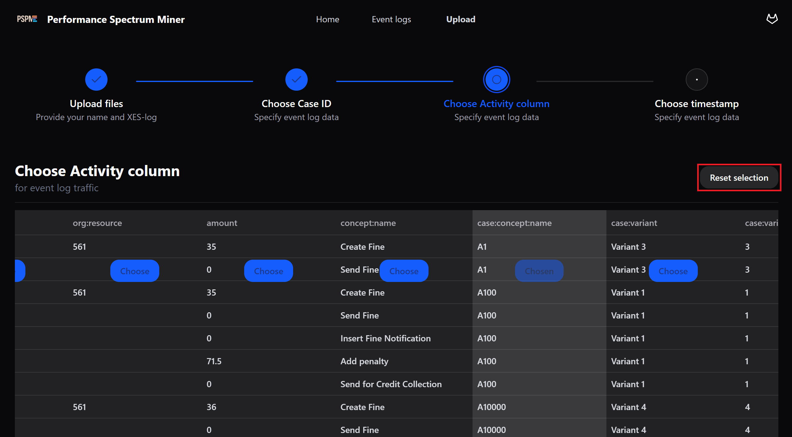

> **Important:** Note that it is crucial to correctly map the columns to ensure that the tool yields correct data.
---

### 3.3 Analyzing the Event Log

Once all columns are correctly mapped:

1. Click the **Analyze** button to initiate event log processing.
2. The system will take you to the main page for analysis that is further discussed in section *4*.

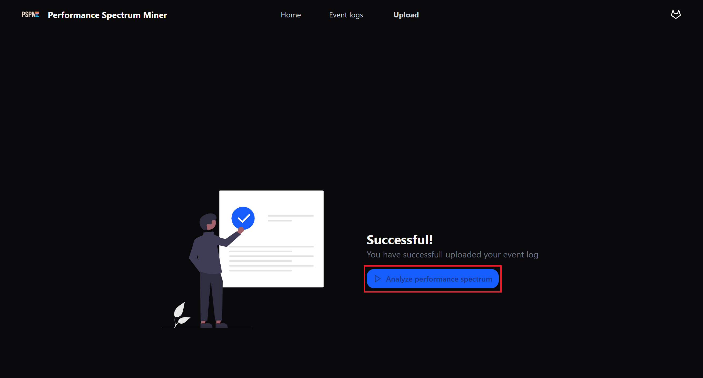

Upon successful analysis, the uploaded event log becomes accessible on the **Event Logs** page, where it is stored and can be accessed later on as well.

---

### 3.4 Accessing Uploaded Event Logs

To view uploaded event logs:

- Navigate to the **Event Logs** page via the main menu.
- The uploaded logs will be listed and available for selection and further processing. 
 
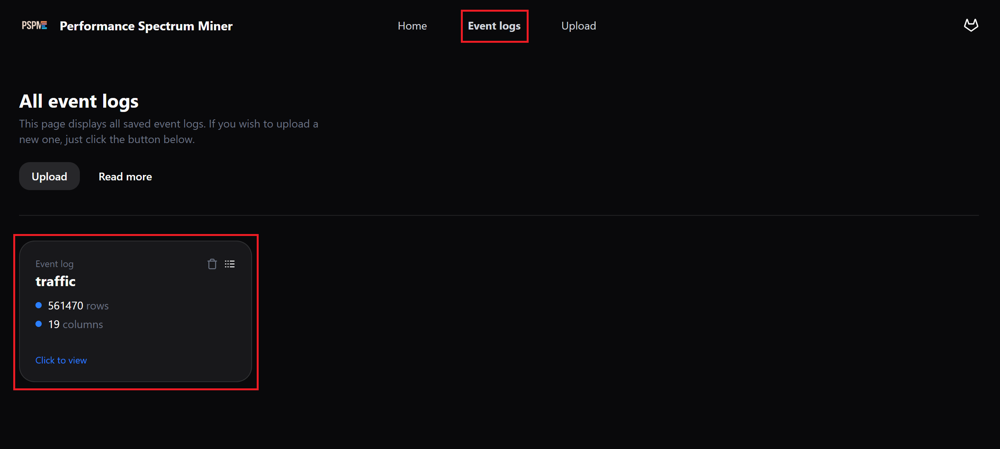

---

### 3.5 Event Logs Page Overview

The **Event Logs** page allows users to view and manage all previously uploaded event logs. Each log is displayed as a card containing:

- The **name** of the event log
- The **number of cases**
- The **number of columns** detected in the file

#### Available Actions

- **Delete**: Click the trash bin icon on a card to remove the event log.  
  > **Caution:** This action is irreversible. Once an event log is deleted, it cannot be recovered.

- **View**: Click on **“Click to view”** to access the **Performance Spectrum** analysis page for the selected event log.

These functionalities are intended to help the user efficiently organize, update, and explore their event logs.

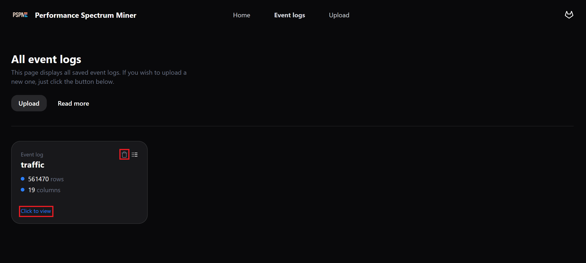

---

### 3.6 Troubleshooting

If you encounter issues during the upload process:

- Verify that the selected file is in valid `.xes` format.
- Confirm that the correct columns have been mapped.
- Wait a moment in case the system is still processing the uploaded data.
- If the spectrum is not shown properly, try deleting it and uploading again.
- If problems persist and you think this may be a technical problem, reach out to us.


---

## 4 Viewing the Spectrum
### 4.1 Page Overview

After having opened the spectrum as described in section *3*, the user is taken to a page that looks as follows:  

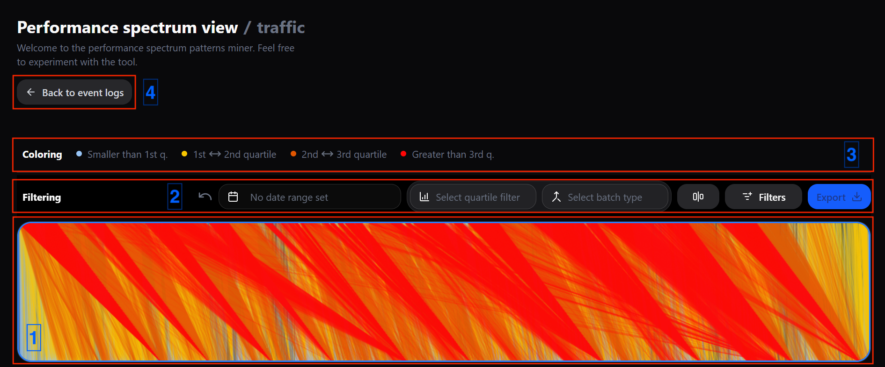

#### 4.1.1 General Structure
The top of the page can be divided into the following sections:
- **1. Performance Spectrum**: The main view the user is concerned about. This is the live representation of the filtered Performance Spectrum. By default, this spectrum shows all the cases with start and end activity, i.e. the start of the line corresponds to the start time of the start activity and the end of the line corresponds to the end of the end activity of each case.
- **2. Filters Bar**: Here, most of the manipulation of the spectrum is done. The following sections will provide a deeper insight on the functionality's details.
- **3. Coloring Legend**: That section explains the meaning of the colors used in the spectrum. More on that in section *4.1.2*.
- **4. Back Button**: Takes the user back to the overview of all saved event logs.

#### 4.1.2 Spectrum Legend

The color of lines in the spectrum is determined by the **quartile** that their duration is in with respect to the entire event log, with each quartile mapped to a distinct color:

| **Color**    | **Quartile**           | **Meaning**           |
| ------------ | ---------------------- | --------------------- |
| Light Blue | 1st Quartile (0–25%)   | Fastest 25% of cases  |
| Yellow     | 2nd Quartile (25–50%)  | Moderately fast cases |
| Orange     | 3rd Quartile (50–75%)  | Moderately slow cases |
| Red        | 4th Quartile (75–100%) | Slowest 25% of cases  |

> **Note:** The quartile is always calculated based on the entire event log, not on the currently shown selection. 

---

### 4.2 Manipulation, Filters & Export

#### 4.2.1 Types of filters
In the context of this manual, one can distinguish between two types of filters:
- **Global Filters**: These filters apply to the entire spectrum and affect all cases. They for example include the selected *variant*, *segment* or *time frame*.
- **Segment specific filter**: These filters apply to the currently selected spectrum and only affect the cases that are shown in the spectrum. Other spectra will automatically adjust to the cases selected. The difference becomes important in the context of *variant selection*, which is covered in section 4.5.

#### 4.2.2 Date-Range Filter
This filter allows the user to focus on a specific time period within the event log. One can activate the date-range filter as follows.

1. Click the **Calendar** icon. A *popover* opens now. 
2. Select two dates following one another by simply clicking the dates number. (One can also navigate the months by clicking the arrows on the top left and right of the *popover*.)
3. Click **Apply** to filter the spectrum by the selected date range. One can also click **Reset** to clear the selection and return to the full spectrum.

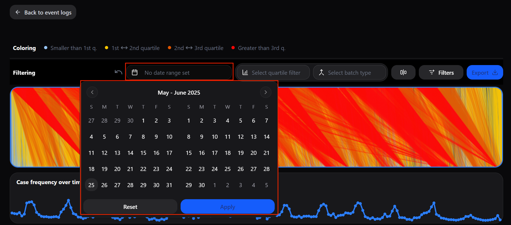

There is however a more precise and also recommended way of doing this. The user can simply click anywhere on the spectrum and drag the *time window* while holding down the left mouse button. Once released, the time frame corresponding to that timeframe is automatically selected.


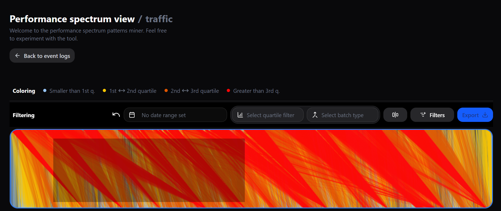

> **Note:** The time frame filter is the very last filter applied on the spectrum and therefore will not interfere with any other filtering methods.

#### 4.2.3 Quartile Filter
This filter gives the user the opportunity to  filter for the *color* of the lines in the spectrum, i.e. the quartile their duration belongs into. To apply the quartile filter, perform the following actions: 
1. Click **Select Quartile filter**
2. Choose a quartile from the dropdown menu.
3. Click **Apply** to filter the spectrum by the selected quartile.

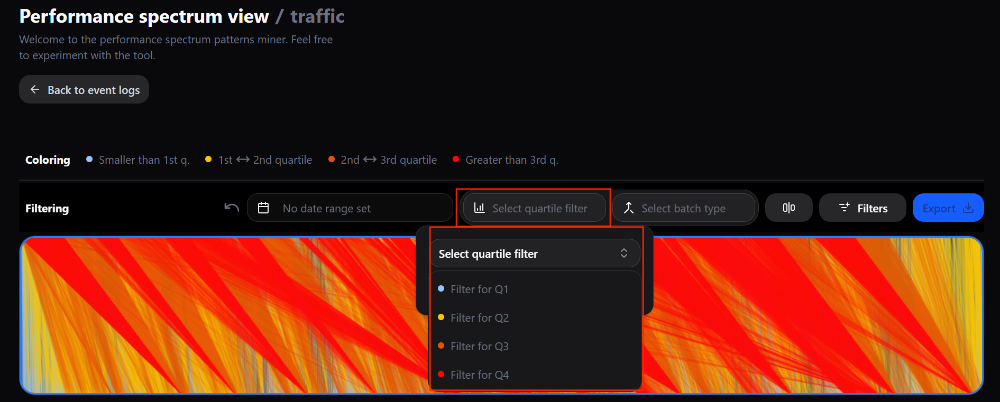

> **Note:** Displays only cases within the chosen duration quartile. The quartile filter does not affect the way that batches are calculated.

#### 4.2.4 Batch filters
In the context of this application, batches are referred to as sets of lines that are grouped together based on their start or end time. 

There are three types of batches that can be filtered for:
- **Start**: Groups cases that start around the same time.
- **End**: Groups cases that end around the same time.
- **Start and End**: Groups cases that start or end around the same time.

Under the hood, the application uses [DBSCAN-Clustering](https://de.wikipedia.org/wiki/DBSCAN) to find these batches. As *DBSCAN* uses two preset parameters, the user can manually set them in the tool to control size and form of a batch.
- **Epsilon**: Determines, how "close" two cases must be in time to belong to the same batch. Increasing this value potentially drags lines in a batch further apart and usually increases the number of batches.
- **Min-Samples**: The minimum number of cases a batch must include to be detected. Increasing this number usually makes batches larger and lowers the total amount of batches.

Furthermore, it is possible to choose only sequential batches using a *first-in, first-out* approach. This is done by identifying the *Longest Increasing Subsequence* of case completion times, ensuring that only cases following a strictly increasing time order are included in the batch.

To apply batch filtering, perform the following steps:

1. Click **Batch Type**.
2. Select a batch type from the dropdown menu (Start, End, Start and End).
3. Adjust **ε (minutes)** and **Min Samples** (One may use +/– without typing into the text field).  
4. Choose whether to consider **only sequential batches**.  
5. Click **Apply**.

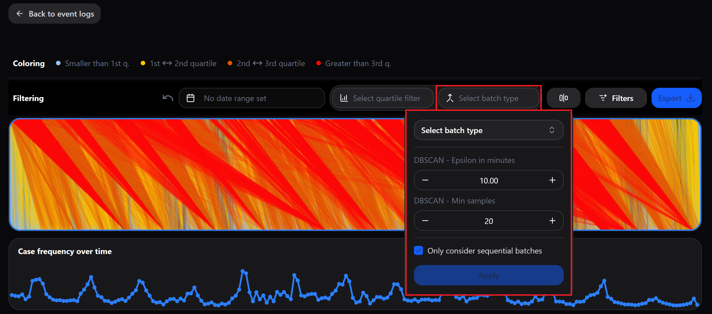

> **Note:** Batches are discovered based on the original Performance spectrum without the quartile or time filter. Applying such filters afterwards may only show parts of detected batches. This is a technical detail and can mostly be ignored.

#### 4.2.5 Manual Case Selection

When hovering over the spectrum with the mouse, a *Tooltip* opens. When the mouse holds down on a set of lines. The *Tooltip* shows the number of cases the user is currently hovering over. The selected cases are now hightlighted in blue.

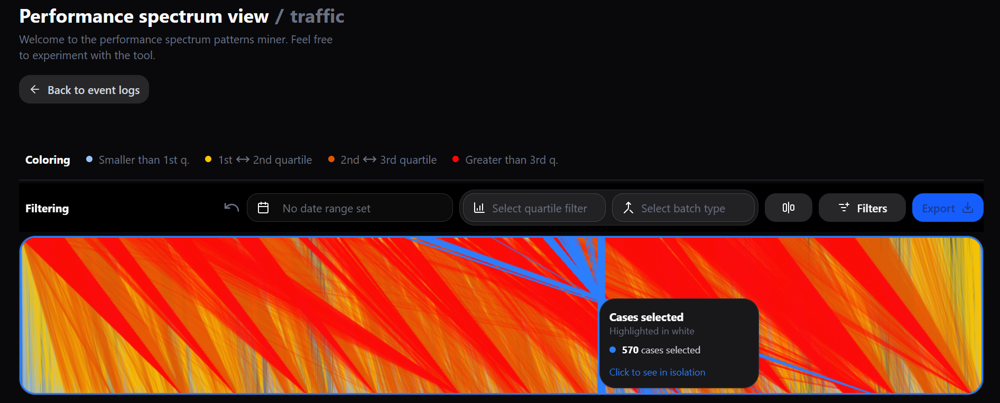  

After clicking on the spectrum without further mouse movement, the system automatically selects the highlighted cases and filters everything for them:

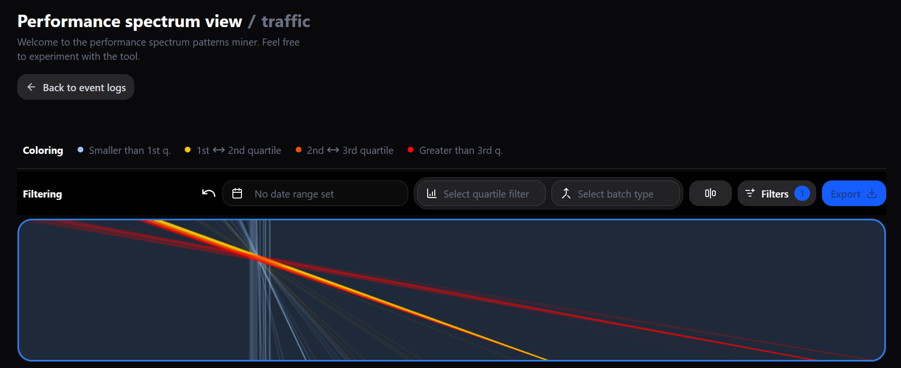

> **Tip:** Use manual selection for quick inspection of standout cases.

> **Note:** The manual filter resets any segment specific filters to enable the user to be able to further use these filters on the selection.

#### 4.2.6 Segment Picker

The user can filter the spectrum for a specific *segment*, i.e. the starting point of a line corresponds to the start of an activity **A** and the end to the start of an activity **B**, where **A** and **B** are activities directly following one another.

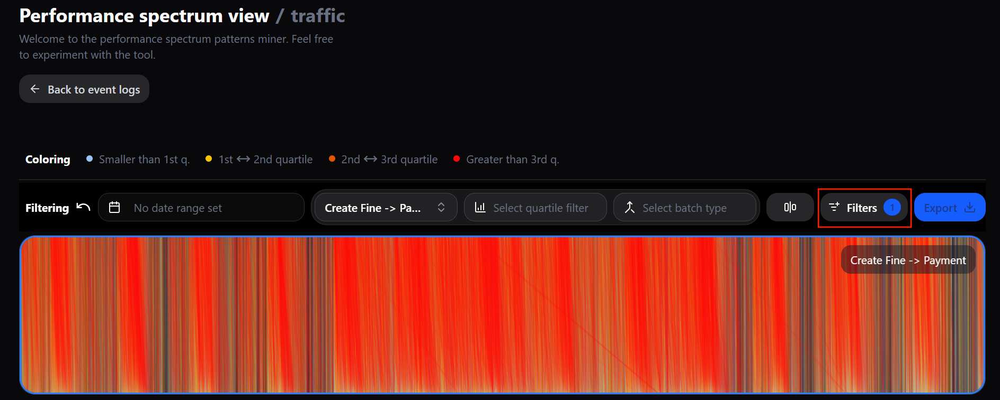

To apply a segment filter, perform the following steps:
1. Click **Filters** in the top right corner of the **Filters Bar**.
2. On the bottom right, there is a section **Filter by segment**.
3. Choose a start and end *activity*.
4. Click **Filter segment** to filter the spectrum by the selected segment.

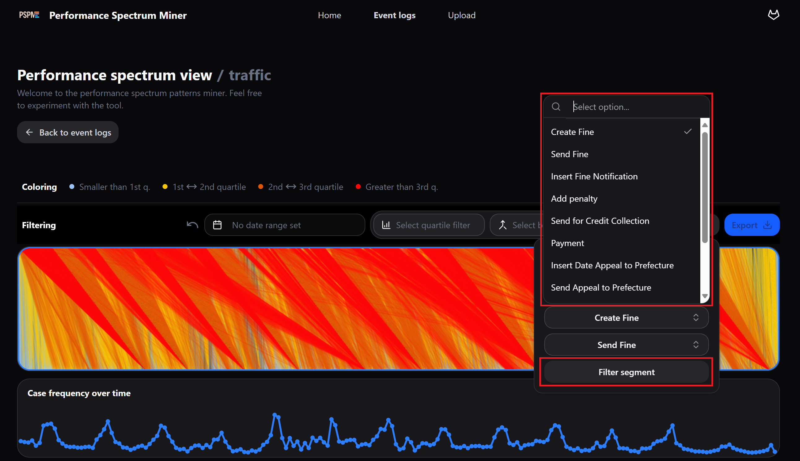

> **Note:** As the Performance Spectrum fundamentally changes the spectrum, segment specific filters are reset.

#### 4.2.7 Managing filters

The tool allows the user to dynamically remove both global filters and segment specific filters. To do that, perform the following steps:

1. Click **Filters** in the top right corner.  
2. Global filters (e.g., quartile, date range) appear at the top.  
3. Click **×** next to a filter to remove them.

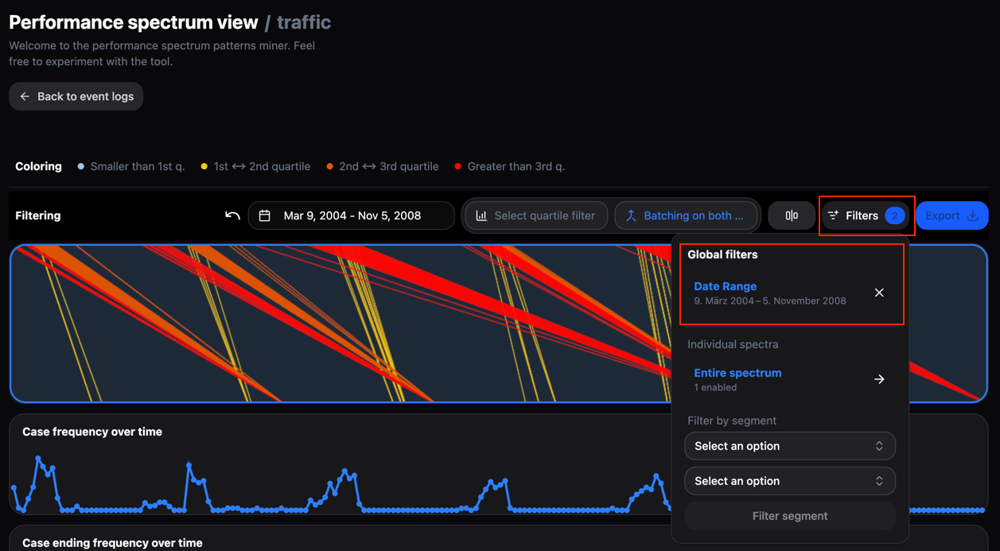

4. To inspect a specific spectrum’s segment specific filters as explained in section 4.1, click on the name of the spectrum (If there is only one, it says **Entire Spectrum**).
5. The system expands a sidebar that gives a similar overview over the active filters as before.
6. Filters can be removed in the exact same way as global filters.

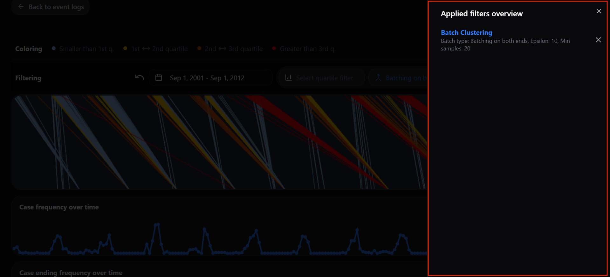

#### 4.2.8 Case Filter History

The system automatically keeps track of every action that the user does (concerning filtering). This enables the user to recover a prior state of the spectrum.

To Undo a filter, click **↶ Undo** to revert the most recent filter or batch. It may show an alert like the following:

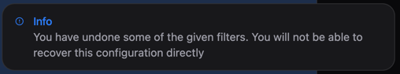

> **Note:** Once undone, it is not possible to directly go a step forward in the filter history.
---

### 4.3 Exporting a spectrum
Exporting in the context of this tool means to export the original event log filtered for the cases in the current spectrum. To obtain the filtered event log,
click **Export**. The download will then automatically start.

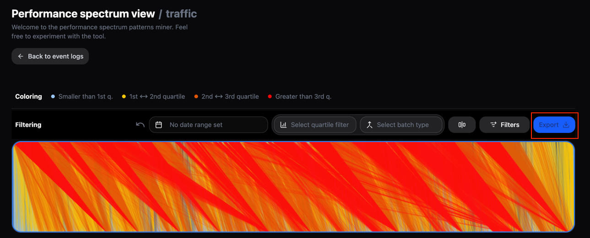

> **Note:** The event logs will be exported as ```.xes``` files.

---

### 4.4 Statistics
To make sense of the patterns detected through the application of the filters mentioned in section *4.2*, this tool additionally provides many quantitative metrics to analyse the performance of a given selection.

#### 4.4.1 Frequency diagrams

Below the Performance Spectrum shown in section *4.1*, one can find two time diagrams that show how frequent cases appear and end in the event log over time. The time span of the spectrum is therefore binned and the number of cases per bin is shown as a point in the diagram. 

The first diagram shows how frequently cases start within the given bin and second diagram shows how frequently they end.

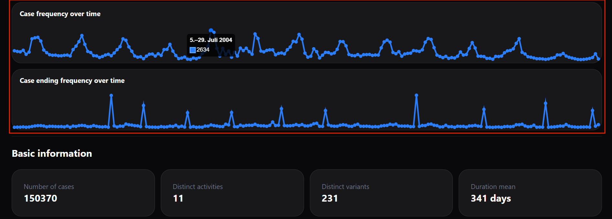

> **Tip:** One can hover over points in the diagrams to see further details such as the time span of a bin and the number of cases contained in it.

#### 4.4.2 Basic Statistics  

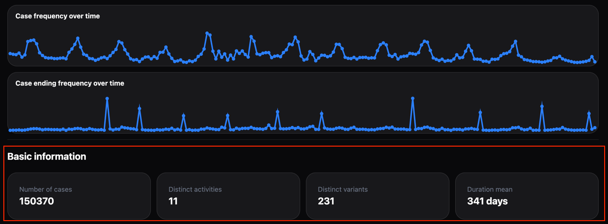

Below the **Frequency Diagrams** from the previous section one can find 4 metrics describing the current selection.
- **Number of Cases**: The total number of cases in the current selection.
- **Distinct activities**: The total number of distinct activities occurring in variants within the spectrum selection.
- **Distinct variants**: The total number of distinct variants, that cases have in the current selection.
- **Duration mean**: The mean time a case takes to finish in the given segment.

Below that, one can see a bar chart that represents the distribution of case duration in the current segment.

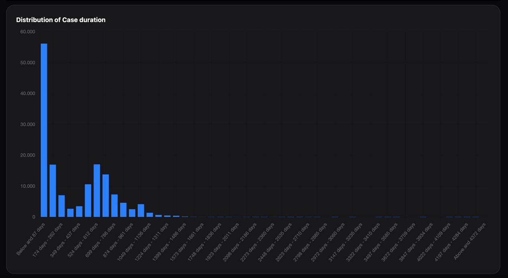

> **Tip:** One can hover over bars in the diagrams to see further details such as duration span of the bar and the total number of cases that fall into this span.

#### 4.4.3 Batch Statistics

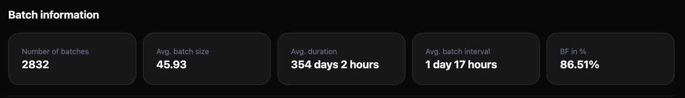

When batch filtering is active for the given segment, the tool displays another section called **Batch Statistics**, which includes the following information:

- **Number of Batches**: The total number of batches detected by the filter in the current segment.
- **Avg. batch size**: The average number of cases in a detected batch.
- **Avg. batch duration**: The average time a case takes to finish in any batch.
- **Avg. batch interval**: The average time a between two batches directly following one another, i.e. the time between their earliest case's start time.
- **BF in %**: The batch frequency, i.e. which portion of cases in the entire event log is part of a batch in the selection.

---
### 4.5 Filtering by variants
One of the most useful functionalities about the *Performance Spectrum Analysis* is to see how cases with delays evolve over time and whether behaviour in another segment, e.g. an earlier activity in the process flow may have caused a case to be delayed.
To be able to comprehend a control flow, one must see the entire variant to analyse an entire case's performance.

#### 4.5.1 Most common variants
On the very bottom of a page, there is a section called **Most common Variants**, that shows the 5 most common variants of cases in the given selection.

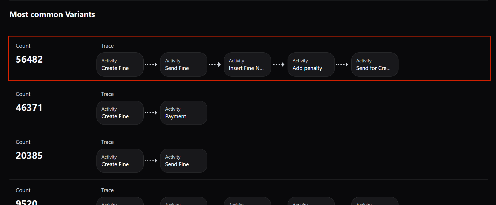

The user can click on one of the variants to show the entire variant in the Performance Spectrum at the top of the page. After clicking, the page scrolls to the top of the page automatically.

#### 4.5.2 Inspecting variants
After having selected a variant to inspect, the spectrum could for example look something like this:

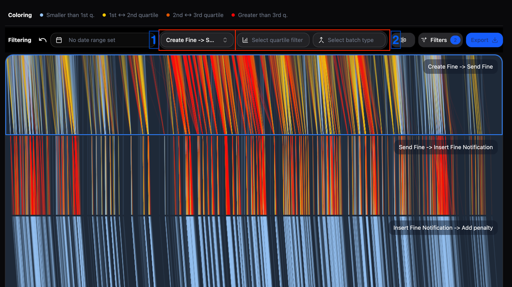

There are a few important things to note here:
In a prior section, the concept of global and segment specific filters was introduced. The difference becomes evident here. 
In the toolbar there is another dropdown menu for selecting a segment (**1**). By default, the first segment of the variant is selected. Changing it has the following effects:
- The highlighted filters (**2**) now change the selected segment.
- All statistics are now calculated for the selected segment.

This enables flexible filtering and analysis of variants, allowing users to focus on specific parts of the process flow.

> **Note**: When filtering a segment, the other segments automatically adapt to the selected cases.

> **Note**: It is possible to combine different filters for different segments.

> **Note**: The managing view from section 4.2.7 now shows multiple spectra and allows the user to flexibly switch between them.

---
### 4.6 Comparing spectra
Sometimes, it can be helpful to have a direct, side-by-side comparison between filtered spectra. For this purpose, this tool introduces the concept of *configurations*.  Understanding this concept is best done by implementing it in practice. 


#### 4.6.1 Creating a new configuration

To create a new *configuration*, click on (**1**) in the filter bar. This triggers a *popover*, that shows the overview over all open *configurations*. To add a new one, click **Add View**. 

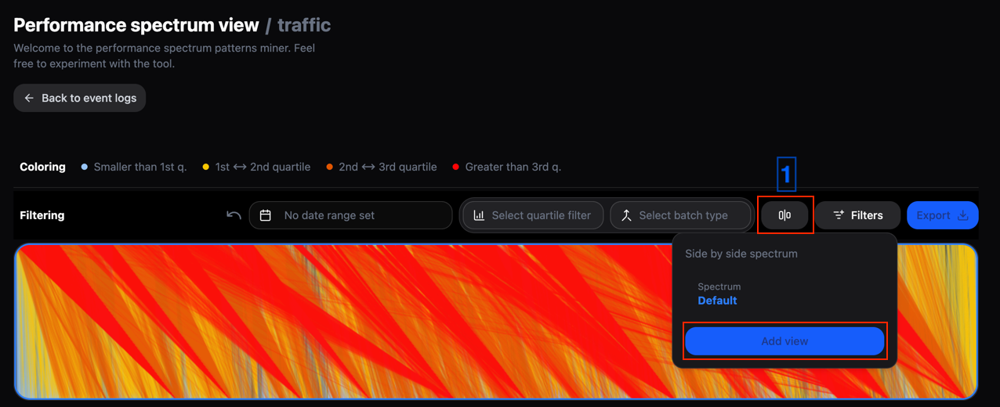

This triggers a *dialog* to open where one can enter the name of the new configuration. Click on **Add** to insert the *configuration*.  

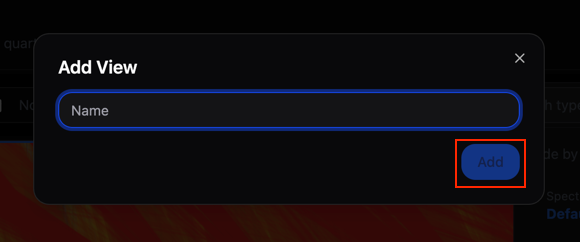

The new *configuration* is then directly added to the viewport.

> **Note:** To be able to tell *configurations* apart later on, it is recommended to use a meaningful name.
> 

#### 4.6.2 Applying filters on multiple configurations

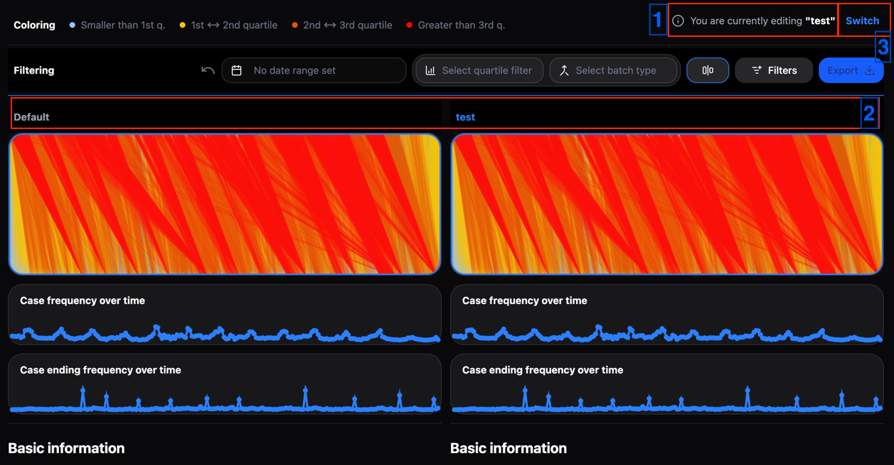

As it can be seen in the screenshot above, there is now a **hint**(**1**) right next to the **Coloring legend**.
Essentially, the filter bar edits the currently selected configuration. Which *configuration* is currently selected can be seen in that **hint**. 
Also, the name of the configurations is now shown on top of them (**2**). The current configuration is highlighted in *blue*. To switch between the two side-by-side configurations, click the **Switch** Button in the top right corner (**3**).


#### 4.6.3 Managing configurations
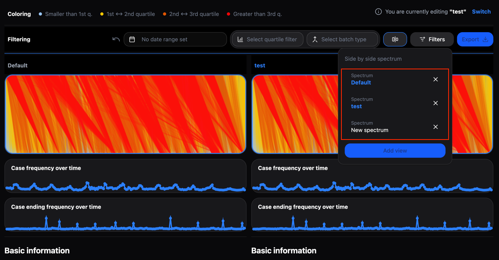

It is possible to create an arbitrary amount of *configurations*. One can delete them by clicking on **x** next to the name of the section as shown above.
When clicking on the name of a configuration, the configuration is imported into the viewport.

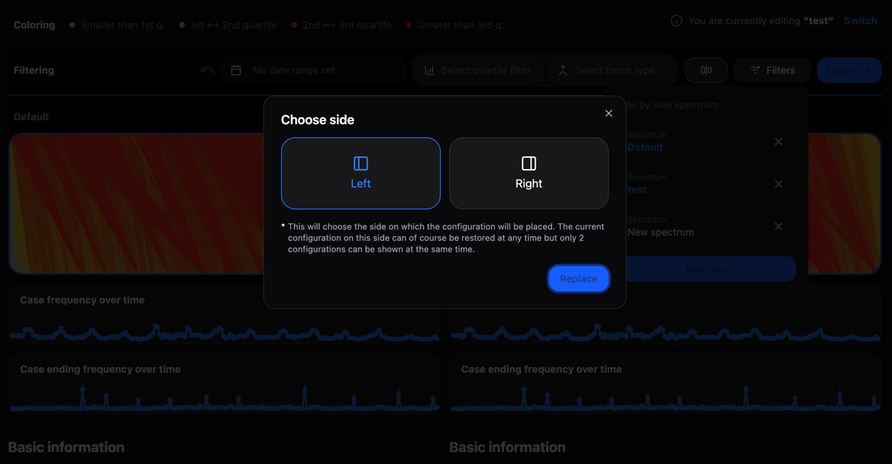

However, when there are already two configurations in the viewport, the tool asks the user which side the new *configuration* should be added to. One can simply click on one of the two slides and then hit **Replace**.

> **Note**: One must have at least one configuration.

---

## 5. Developer Guide

In this section, the general architecture, structure and logic of the project is summarized to make exploring the codebase easier.

### 5.1 Backend
#### 5.1.1 Technology Stack
- **HTTP Interface**: Regular REST-Api built in [FastAPI](https://fastapi.tiangolo.com/) with [Pydantic](https://docs.pydantic.dev/latest/) for data validation.
- **Database**: Simple *SQLite* Database file, that is migrated using [Alembic](https://alembic.sqlalchemy.org/en/latest/) and accessed using [SQLAlchemy](https://www.sqlalchemy.org/). [SQLAlchemy](https://www.sqlalchemy.org/) is an ORM (*Object Relational Mapper*) for easier data querying and manipulation.
- **Utility**: Most of the utility function used to analyze an event log is done in [Pandas](https://pandas.pydata.org/) or [pm4py](https://pypi.org/project/pm4py/) .

#### 5.1.2 File structure

The general file structure of the backend looks as follows:
```
backend/
├── app/
│   ├── ...
│   ├── models
│   │   └── ...
│   └── performance_spectrum
│   │    ├── miner/
│   │    │   ├── LogStatisticsMiner.py
│   │    │   ├── SpectrumMiner.py
│   │    │   ├── SpectrumPatternsMiner.py
│   │    ├── common.py
│   │    ├── PerformanceSpectrum.py
│   └── pydantic_models/
│   │    ├── spectrum_filter_schema.py
│   └── services/
│   │    ├── ...
│   ├── ...
│   ├── main.py
│   └── routes.py
└── unittests/
    └── ...
```

The ``app`` folder contains most of the logic.
Among other things it contains the applications main entry point in ```main.py```. This file initializes all the necessary libraries and files like *FastAPI* and the *database*.


```/models``` contains the SQLite database ```Eventlog```. EventLog stores the basic data of uploaded event logs like the Case ID, Activity, Timestamp and the path to the actual event log on the server. The only purpose of this database model is to store all the essential information required to perform Process Mining. The actual operations are performed on the Pandas Dataframes of the parsed Event log file.
In ```/pydantic_models``` models, that define the structure of HTTP-Bodies for the application's requests, are stored.
Here, the most important model is the ```spectrum_filter_schema.py```, which defines the structure of filters for the application's main route.


All HTTP routes are defined in ```routes.py```. We tried separating definition of routes, validation logic and actual application logic from another. Therefore validation is mainly done by pydantic and application logic is in the *serviced* in ```/services```. It currently only contains the `event_log_service.py`.


#### 5.1.3 Querying Spectra
We tried designing our "filtering framework" in such a way, that results may be partly reusable in the future. Therefore the entire syntax is "query-like".
```python
query = PerformanceSpectrum.using(event_log)
  .variant(...)
  .cases(...)
  .time(...)
  
query.on(spectrum)
  .batches(...)
  .spectrum()
```

This logic is divided into a variety of subclasses:
- **PerformanceSpectrum**: Main class to start querying an event log.
- **PerformanceSpectrumBuilder**: Returned by ```PerformanceSpectrum.using(...)```. The class has an internal cache and fetches the general structure of a ```SpectrumCollection```, i.e. filters the log by variant, by segment or simply pre-filters cases (Filters that apply to all segments that are displayed in the frontend)
- **SpectrumCollection**: Returned by a ```PerformanceSpectrumBuilder```. It contains all segments of the spectrum and also contains methods to query filters. It has a method ```spectrum()```, that performs the "query" and prepares all the data required to display the spectrum in the frontend. This is done because some filters need to be performed in the correct order, as otherwise one would leave this decision to the programmer, potentially causing undefined behavior.

The mentioned subclasses call methods from the following classes within ```/performance_spectrum/miner/```:
- **SpectrumMiner**: Contains the logic to filter the data for the ```PerformanceSpectrumBuilder```.
- **SpectrumPatternsMiner**: Applies segment specific filters such as batch filters and quartile filters.
- **LogStatisticsMiner**: Extracts all the statistics that are shown in the frontend and that are retrieved after the Spectrum is extracted and filtered.

### 5.2 Frontend

#### 5.2.1 Technology stack
- **General Framework**: [Vue.js](https://vuejs.org/) in the standard form, i.e. without *Typescript*. [Vite](https://vitejs.dev/) is used as the build tool.
- **Component Library**: [Shadcdn Vue](https://www.shadcn-vue.com/) for standardized and out-of-the-box standard components (such as inputs etc.)
- **Styling**: To ease up styling and also making html code easier to understand, [Tailwindcss](https://tailwindcss.com/) is used throughout the entire project.
- **Utility**: Rarely used, but for convenience, [Lodash](https://lodash.com/) is also part of this project.


#### 5.2.2 File structure

The general file structure of the frontend looks as follows:
```
frontend/
├── src/
│   ├── ...
│   ├── components/
│   │   ├── ...
│   │   └── ui/
│   │       └── Button.vue
│   ├── composables/
│   │   ├── useConfigurationState.js
│   │   ├── useErrorState.js
│   │   └── useEventLogState.js
│   ├── views/
│   ├── App.vue
│   ├── constants.js
│   ├── main.js
│   └── routes.js
└── ...
```
All important files of the project are located in the ```/src``` directory. The parent directory otherwise only consists of configuration files.

The app's main entry point is ```main.js```, where the Vue app is initialized and the main component ```App.vue``` is mounted.
The App furthermore uses *vue-router* to enable *Single-page Routing*.
The Routes are declared in ```routes.js```, whilst all the important view-components, i.e. the page components are stored in ```/views```.

Composite components or components we do not use directly as a page wrapper are all stored in ```/components```. Here, they are grouped by the page they are used in. 
Components that can potentially be used on multiple pages are just stored directly in the directory. There is however one exception: All *Shadcdn*-components are stored in ```/components/ui/```. 
These are just out-of-the-box components of the application's component library.

#### 5.2.3 Application Logic
Most of the frontend logic and state that covers multiple components is stored in ```composables/...```.
There are three main states used.
- **useErrorState.js**: A simple state that provides functions to display and mutate the alerts in the bottom right corner of the screen, i.e. errors, info toasts or warnings.
- **useEventLogState.js**: Here the Event Log is fetched from the server. Notice that the *currentEventLog* of the page is eager loaded in the computed property, so that backend calls are minimized on component level. Besides the general information about an event log, event logs also store attributes concerning *configurations*. In the context of this app, *configurations* are referred to as the instances that can be selected in the side-by-side view. Their individual state is stored in the configurations object in this file.
- **useConfigurationState.js**: This state manages the state of the current *configuration* as explained before. Because multiple states exist at the same time, the correct state is loaded through the [Provide/Inject](https://vuejs.org/guide/components/provide-inject) functionality of Vue, so that the id of the currently shown configuration does not have to be provided in the Vue Components. This logic can be inspected in the file in more detail. The most important thing to note here, is that there are two functions ```initState()``` defining the structure of the state and ```stateSetup()``` defining watchers and more advanced interactions with the state. This is where the actual application logic is located. 

